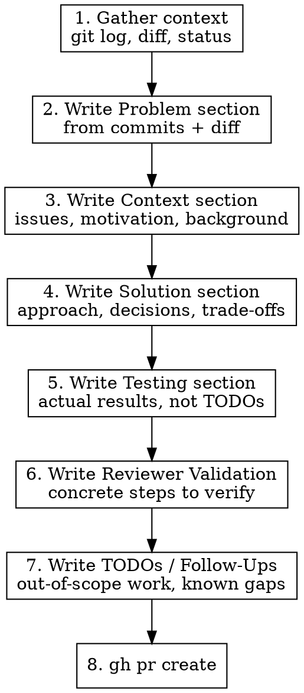

# Create PR

## Overview

Every PR description must answer six questions: What problem? Why now? How was it solved? What testing was done? How can a reviewer verify? What's left? This skill enforces that structure.

## When to Use

- User asks to create a PR or open a pull request
- User invokes `/create-pr`
- You are about to run `gh pr create`

## PR Description Template

```
## Problem

<What is broken, missing, or inadequate? 1-3 sentences describing the specific
problem this PR solves. Focus on the user-facing or system-level impact.>

## Context

<Why does this problem exist? What background does a reviewer need?
Link to issues, prior discussions, or architectural decisions.
Include "Closes #N" here if applicable.>

## Solution

<How was the problem solved? Describe the approach and key design decisions.
Highlight trade-offs considered and why this approach was chosen.
Keep it concise — the diff shows the details, this explains the thinking.>

## Testing

### Unit tests
<List new or modified unit tests with a brief description of what each covers.
If none, explain why.>

### Integration tests
<List integration tests, end-to-end tests, or manual testing performed.
If none, explain why.>

### Test results
<Paste or summarize actual test output: pass count, failures, coverage delta.
"All 47 tests pass" is better than a checkbox.>

## Reviewer Validation

<Step-by-step instructions for a reviewer to verify the changes work:>

1. <Specific command to run or file to inspect>
2. <What to look for / expected outcome>
3. <Edge case worth exercising manually>

## TODOs / Follow-Ups

<List any known issues, improvements, or related work that is intentionally
out of scope for this PR. Link to tracking issues where they exist.
If there are none, state "None — this PR is self-contained.">
```

## Workflow



### Step 1 — Gather context

Run these in parallel:

```bash
git status
git log main..HEAD --oneline
git diff main...HEAD --stat
```

Read the full diff if the stat is small enough. For larger PRs, read changed files selectively to understand the scope.

### Step 2 — Write Problem section

From the commits and diff, identify the concrete problem being solved. Do NOT describe the solution here — describe what was wrong or missing before this PR.

### Step 3 — Write Context section

Add background a reviewer needs: why this problem exists, links to issues, architectural decisions, or prior discussion. Include `Closes #N` if applicable.

### Step 4 — Write Solution section

Explain the approach taken and why. Focus on:

- Key design decisions and alternatives considered
- Trade-offs made (performance vs readability, scope vs complexity, etc.)
- Anything non-obvious about the implementation that the diff alone won't convey

Do NOT rehash the diff — the reviewer can read code. Explain the *thinking* behind it.

### Step 5 — Write Testing section

**Report what was done, not what should be done.**

- List specific test files and what they cover
- Distinguish unit tests from integration/manual tests
- Include actual test output (pass counts, not checkboxes)
- If a category has no tests, explain why — don't omit it

### Step 6 — Write Reviewer Validation

Give the reviewer a concrete path to verify the changes:

- Commands to run (`make test`, `uv run pytest tests/specific_file.py`)
- Files to inspect and what to look for
- Manual steps to exercise the feature (if applicable)
- Edge cases worth checking

### Step 7 — Write TODOs / Follow-Ups

List work that is intentionally out of scope for this PR:

- Known limitations or edge cases not yet handled
- Future improvements this change enables
- Related issues that should be filed or linked
- If nothing is outstanding, state "None — this PR is self-contained."

This section prevents scope creep during review and gives the reviewer confidence that gaps are known, not overlooked.

### Step 8 — Create the PR

```bash
gh pr create --title "<type>: <concise description>" --body "$(cat <<'EOF'
<body from steps 2-7>

Generated with [Claude Code](https://claude.com/claude-code)
EOF
)"
```

## Title Conventions

- Keep under 72 characters
- Use conventional commit prefix: `feat:`, `fix:`, `chore:`, `refactor:`, `docs:`, `test:`
- Describe the outcome, not the mechanism

## Common Mistakes

| Mistake | Fix |
|---------|-----|
| Listing changed files | Reviewer can see the diff — describe *what* and *why*, not *where* |
| Test plan as TODO checkboxes | Report what *was* tested with actual results |
| Skipping "Problem" | Every PR solves a problem — if you can't articulate it, the PR may not be needed |
| Vague reviewer steps | "Review the code" is not validation — give specific commands and expected output |
| Omitting test category | If there are no integration tests, say so and explain why — don't silently skip |
| Describing *what* changed in Solution | The diff shows what — explain *why* and *how you decided* |
| Empty TODOs section | Always include it — "None — this PR is self-contained" is a valid answer |
| Dumping a wish list in TODOs | Only list concrete, actionable items — link to issues where possible |
