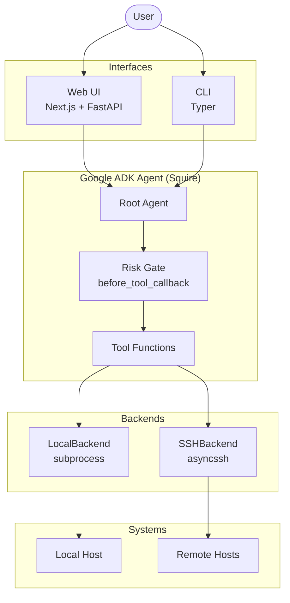
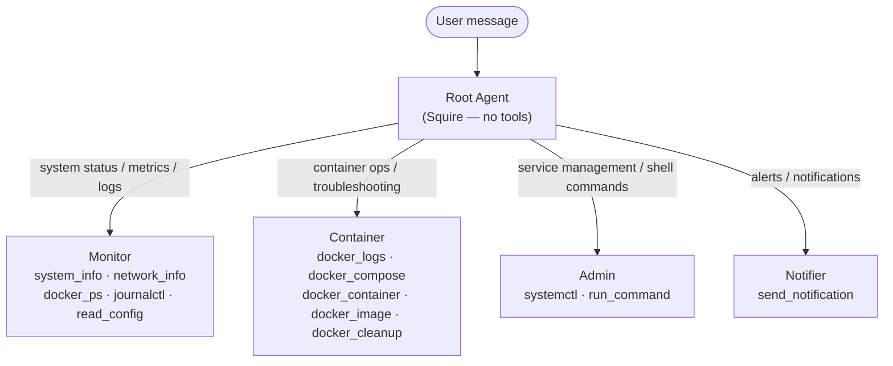
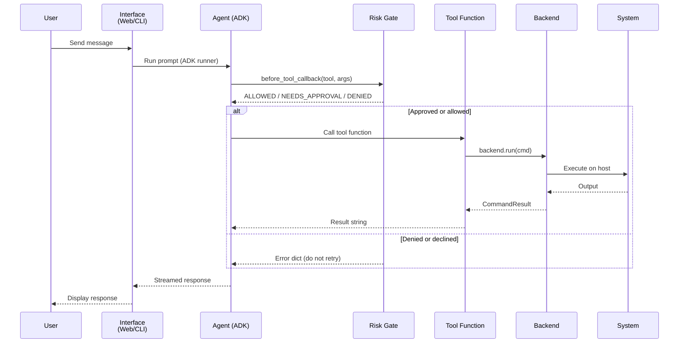
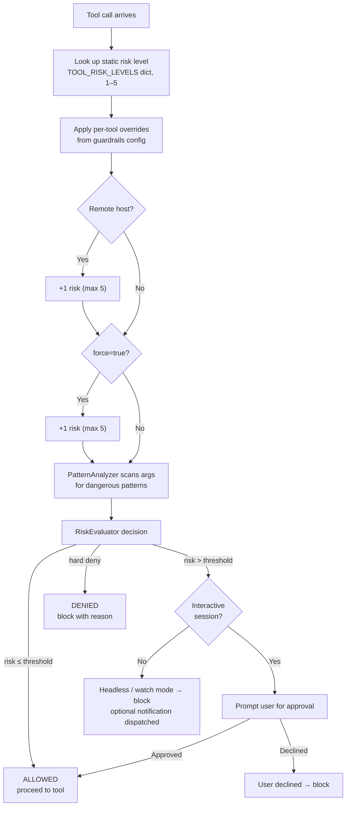
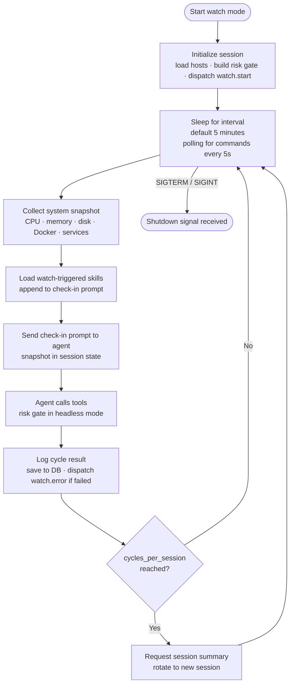

# Architecture Overview

Squire is an AI-powered homelab monitoring and management agent. A Google ADK agent (single or multi-agent) receives requests from the Web UI or CLI and acts on local and remote hosts through a typed backend abstraction layer. Every tool call passes through a risk evaluation pipeline before execution, so dangerous operations require explicit approval or are blocked outright in headless mode.

## System Overview




## Agent Architecture

Squire operates in one of two modes, controlled by `multi_agent` in `squire.toml`.

**Single-agent mode** (default): one `Squire` agent holds all tools directly. Simpler, lower latency, works well for smaller models.

**Multi-agent mode**: the root `Squire` agent has no tools of its own. It routes requests to four specialized sub-agents via ADK's transfer pattern. Each sub-agent gets a scoped tool set and its own risk gate configured for its domain. Useful when you want tighter per-domain risk budgets or a model that benefits from narrower context.

In both modes, the user always sees the single "Squire" persona — sub-agent names are internal implementation details.

### Sub-agents


| Agent     | Domain                | Tools                                                                                                  | Characteristic Risk        |
| --------- | --------------------- | ------------------------------------------------------------------------------------------------------ | -------------------------- |
| Monitor   | System observation    | `system_info`, `network_info`, `docker_ps`, `journalctl`, `read_config`                                | Read-only, risk 1          |
| Container | Docker lifecycle      | `docker_logs`, `docker_compose`, `docker_container`, `docker_image`, `docker_cleanup`                  | Cautious, risk 1–4         |
| Admin     | System administration | `systemctl`, `run_command`                                                                             | Elevated, risk 1–4         |
| Notifier  | Ad-hoc notifications  | `send_notification`                                                                                    | Mostly read-only, risk 1–2 |


### Multi-agent routing




## Request Flow




## Risk Evaluation Pipeline

Every tool call is intercepted by the `before_tool_callback` before execution. The pipeline uses the `agent-risk-engine` library with homelab-specific extensions.



### Effect classification (orthogonal UI metadata)

Every tool also declares an `EFFECT` — `"read"` (observes only), `"write"` (mutates state), or `"mixed"` (both, or depends on arguments). Multi-action tools declare per-action effects in `EFFECTS: dict[str, Effect]`, and the tool-level effect is derived (`read` if all actions read, `write` if all write, else `mixed`). The registry lives alongside `TOOL_RISK_LEVELS` as `TOOL_EFFECTS` in `squire.tools`, and `GET /api/tools` surfaces the value per tool and per action. Skills carry the same field under frontmatter `metadata.effect` (default `"mixed"`).

Effect is purely UI metadata today — it is not consumed by the risk gate, guardrails, or approval policy. Risk is about severity; effect is about what the tool *does*. A `write` can be low risk (`docker_image:pull`) and a `read` can be sensitive (`read_config` on a secrets file). Keep the two axes separate.


### Homelab risk patterns

The `PatternAnalyzer` inspects command arguments for patterns that escalate risk beyond the static level:


| Pattern                            | Escalates to | Reason                         |
| ---------------------------------- | ------------ | ------------------------------ |
| `--privileged`                     | 5            | Privileged container mode      |
| `iptables`, `ufw`, `nftables`      | 4            | Firewall rule modification     |
| `systemctl mask/disable`           | 4            | Service disablement            |
| `/var/lib/docker/`, `/etc/docker/` | 4            | Docker data/config directories |
| `ssh-keygen`, `authorized_keys`    | 4            | SSH key modification           |
| `crontab -r/-e`                    | 3            | Crontab modification           |


## Watch Mode Loop

Watch mode is the autonomous monitoring path. There is no interactive user; the agent runs on a timer. The risk gate operates in headless mode — `NEEDS_APPROVAL` results are denied rather than prompted, and blocked actions can trigger webhook notifications.




Watch mode is started with `make watch` or `uv run squire watch`. The web UI **Watch** page shows live stream events, scoped cycle history, and current status; **Watch Explorer** (`/watch-explorer`) surfaces persisted watch runs, sessions, cycles, and reports. See [configuration.md](configuration.md) for `[watch]` and `[guardrails]` options.

## Tech Stack


| Layer               | Technology                  | Purpose                                                                 |
| ------------------- | --------------------------- | ----------------------------------------------------------------------- |
| Agent Orchestration | Google ADK                  | Multi-agent routing, tool dispatch, conversation management             |
| LLM Abstraction     | LiteLLM                     | Provider-agnostic model access (Ollama, Anthropic, OpenAI, Gemini, 50+) |
| Risk Evaluation     | agent-risk-engine           | Pattern-based risk analysis, rule gating, tool blocking                 |
| Web API             | FastAPI + Uvicorn           | REST endpoints, WebSocket streaming                                     |
| Web Frontend        | Next.js + React + shadcn/ui | Browser-based chat, watch monitoring, configuration                     |
| CLI                 | Typer                       | Command-line interface for scripting and quick tasks                    |
| Database            | aiosqlite (SQLite)          | Session persistence, events, watch state                                |
| Remote Access       | asyncssh                    | SSH-based multi-machine management                                      |
| Config              | Pydantic Settings           | Layered config (env vars > DB overrides > TOML > defaults)              |
| HTTP Client         | httpx                       | Webhook notifications, health checks                                    |


## Database Schema

All state is stored in a single SQLite file (default: `~/.local/share/squire/squire.db`). The schema is created idempotently on first connection.


| Table             | Purpose                                                                               |
| ----------------- | ------------------------------------------------------------------------------------- |
| `snapshots`       | Time-series system snapshots (CPU, memory, uptime, raw JSON)                          |
| `events`          | Activity feed: category, summary, optional `session_id`, `watch_id`, `watch_session_id`, `cycle_id`, tool metadata |
| `conversations`   | Chat messages keyed by session ID (role, content, optional token usage fields)        |
| `sessions`        | Session registry with created/last-active timestamps and preview                      |
| `watch_state`     | Key-value store for current watch mode status (cycle, PID, interval, supervisor counts, cumulative metrics, etc.) |
| `watch_runs`      | One row per watch invocation (`watch_id`), timestamps, status, link to watch-level report |
| `watch_sessions`  | Agent sessions within a run (`watch_session_id`, `adk_session_id`, cycle counts, session report) |
| `watch_cycles`    | Canonical per-cycle aggregates (tokens, tool/incident counts, status, timing) keyed by `cycle_id` |
| `watch_reports`   | Structured completion reports (watch- and session-level JSON digests)                 |
| `watch_events`    | Append-only stream per cycle (`cycle_id`, `watch_id`, `watch_session_id`): tokens, tool calls, phases, incidents, cycle boundaries |
| `watch_commands`  | Commands from the API to the watch process (`start`, `stop`, `reload_config`)         |
| `config_overrides` | Per-field UI overrides (section, field, value_json) that take precedence over `squire.toml` at load time |
| `watch_approvals` | Approval requests from watch mode (pending / approved / denied)                     |
| `managed_hosts`   | Remote hosts registered via the Hosts page (address, SSH config, tags, services)      |


## Backend Registry

All tool execution goes through the `BackendRegistry`, which maps host names to `SystemBackend` implementations.

```python
# SystemBackend protocol
async def run(cmd: list[str], timeout: float = 30.0) -> CommandResult
async def read_file(path: str) -> str
async def write_file(path: str, content: str) -> None
async def close() -> None
```

Two implementations:

- `**LocalBackend**` — wraps `asyncio.create_subprocess_exec`. Always present; registered as `"local"`.
- `**SSHBackend**` — wraps `asyncssh`. Created lazily on first access for each configured remote host.

`BackendRegistry.get("local")` always returns the `LocalBackend`. For remote hosts, the registry creates an `SSHBackend` on first use and caches it. Tools accept an optional `host` parameter (default `"local"`) which the registry resolves. Passing an unconfigured host name raises a `ValueError` before any tool logic runs.

The risk gate adds `+1` to the risk level for any tool call where `host != "local"`, reflecting the higher blast radius of remote operations.

## Project Structure

```
src/squire/              Main application
  agents/                ADK agent definitions (root agent + 4 sub-agents)
  api/                   FastAPI routers (chat, system, sessions, alerts, skills, watch, hosts)
  callbacks/             Risk gate (before_tool_callback implementation)
  config/                Pydantic Settings config loaders (app, llm, database, hosts, skills, watch, guardrails)
  database/              SQLite service and schema
  instructions/          Dynamic system prompt builders for each agent
  skills/                File-based skill service (Open Agent Skills spec)
  notifications/         Webhook dispatcher and email notifier
  schemas/               Pydantic models for API request/response
  system/                Backend registry, LocalBackend, SSHBackend
  tools/                 System interaction tools (async, return str)
    notifications/       Ad-hoc notification tools (Notifier sub-agent)

web/                     Next.js frontend
  src/app/               Pages: chat, watch, watch-explorer, skills, tools, sessions, hosts, notifications, config, activity
  src/components/        UI components (sidebar, charts, dialogs, etc.)
  src/hooks/             Custom React hooks (SWR-based data fetching)
  src/lib/               API client, TypeScript types, utilities

tests/                   pytest suite
  conftest.py            MockBackend, MockRegistry fixtures
  test_tools/            Tool unit tests
  test_agents/           Agent routing tests
  test_callbacks/        Risk gate tests
  test_notifications/    Alert and webhook tests
```

See [configuration.md](configuration.md) for all available `squire.toml` options and [cli.md](cli.md) for CLI command reference.