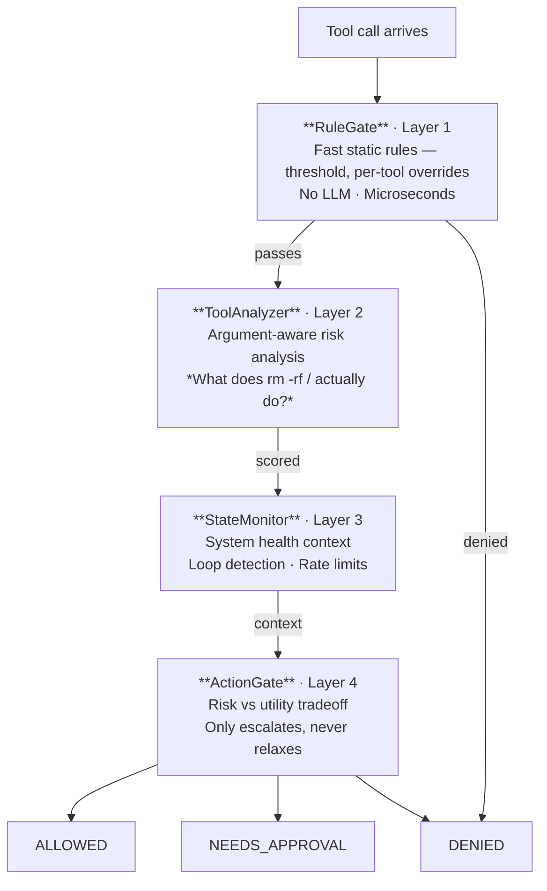

# agent-risk-engine (ARE)

Layered risk evaluation for AI agent tool execution.

`agent-risk-engine` is a framework-agnostic pipeline that evaluates whether an agent's action should be **allowed**, **require user approval**, or be **denied** based on static rules, argument analysis, system state, and a final integration gate.

## Installation
### UV
```bash
uv add agent-risk-engine
```

### pip
```bash
pip install agent-risk-engine
```

## Quick Start

```python
from agent_risk_engine import RuleGate, RiskEvaluator, GateResult

# Create a rule gate with a threshold (1-5 or alias)
gate = RuleGate(threshold="cautious")  # alias for level 2

# Build the evaluator pipeline
evaluator = RiskEvaluator(rule_gate=gate)

# Evaluate a tool call
result = await evaluator.evaluate("read_file", {}, tool_risk=1)
assert result.decision == GateResult.ALLOWED

result = await evaluator.evaluate("execute_shell", {"command": "rm -rf /"}, tool_risk=5)
assert result.decision == GateResult.NEEDS_APPROVAL
```

## Architecture

Tool calls pass through four evaluation layers before execution:



**Layer 1 (RuleGate)** and **Layer 4 (RiskUtilityGate)** are fully implemented. Layers 2-3 ship as protocol interfaces with passthrough stubs — plug in your own implementations as needed.

## Risk Levels

| Level | Label    | Meaning                          |
|-------|----------|----------------------------------|
| 1     | Info     | Read-only, no side effects       |
| 2     | Low      | Reads potentially sensitive data |
| 3     | Moderate | Reversible mutations             |
| 4     | High     | Hard-to-reverse mutations        |
| 5     | Critical | Destructive or irreversible      |

## RuleGate

The `RuleGate` is the core of Layer 1 — fast, deterministic, no LLM required.

```python
gate = RuleGate(
    threshold=2,                         # auto-allow tools at risk level <= 2
    strict=False,                        # False = prompt above threshold; True = deny
    allowed_tools={"read_logs"},         # always auto-allow, regardless of threshold
    approve_tools={"restart_service"},   # always prompt, even if threshold would allow
    denied_tools={"delete_database"},    # hard block, never execute
)
```

### Threshold Aliases

| Alias        | Level | Description |
|--------------|-------|-------------|
| `read-only`  | 1     | Only info-level tools |
| `cautious`   | 2     | Info + low-risk tools |
| `standard`   | 3     | Up to reversible mutations |
| `full-trust` | 5     | Everything auto-allowed |

### Evaluation Order

1. **Denied tools** — always denied, regardless of threshold
2. **Allowed tools** — always allowed, regardless of threshold
3. **Approve tools** — always requires approval
4. **Threshold** — compare tool risk level against threshold

## RiskUtilityGate (Layer 4)

The `RiskUtilityGate` weighs risk against caller-provided utility for a final go/no-go decision. Utility is an **input**, not computed internally — the library evaluates risk; your framework understands agent goals and provides utility.

```python
from agent_risk_engine import RiskEvaluator, RuleGate, RiskUtilityGate, UtilityScore, GateResult

evaluator = RiskEvaluator(
    rule_gate=RuleGate(threshold="standard"),
    action_gate=RiskUtilityGate(),
)

# High utility justifies the risk — no escalation
result = await evaluator.evaluate(
    "write_file", {"path": "output.txt"}, tool_risk=3,
    utility=UtilityScore(level=4, reasoning="User explicitly requested file creation"),
)
assert result.decision == GateResult.ALLOWED

# Low utility doesn't justify the risk — escalated
result = await evaluator.evaluate(
    "write_file", {"path": "output.txt"}, tool_risk=3,
    utility=UtilityScore(level=1, reasoning="Speculative write"),
)
assert result.decision == GateResult.DENIED
```

### Escalation Rules

The gate **only escalates, never relaxes** — it cannot make a decision less restrictive than Layer 1's.

| Condition | Effect |
|-----------|--------|
| `utility >= effective_risk` | No escalation |
| `gap == 1` (risk exceeds utility by 1) | Escalate one step (ALLOWED → NEEDS_APPROVAL) |
| `gap >= 2` | Escalate two steps (ALLOWED → DENIED) |
| Unhealthy system + `gap > 0` | +1 additional escalation step |

`effective_risk = risk_score.level + system_state.risk_adjustment`

Layer 1 DENIED results are always respected — utility cannot override a hard deny.

## Extending Layers 2-3

Each layer is defined as a Python `Protocol`. Implement the interface and pass your implementation to `RiskEvaluator`:

```python
from agent_risk_engine import RiskEvaluator, RuleGate, RiskScore

class LLMAnalyzer:
    """Use an LLM to evaluate the actual risk of tool arguments."""

    async def analyze(self, tool_name: str, args: dict, tool_risk: int) -> RiskScore:
        # Your LLM call here — inspect args, reason about consequences
        assessed_level = await my_llm_judge(tool_name, args)
        return RiskScore(level=assessed_level, reasoning="LLM analysis")

evaluator = RiskEvaluator(
    rule_gate=RuleGate(threshold="cautious"),
    tool_analyzer=LLMAnalyzer(),
)
```

### StateMonitor Example

```python
from agent_risk_engine import SystemState

class LoopDetector:
    """Detects repeated tool calls that may indicate an agent loop."""

    def __init__(self):
        self._recent_calls: list[str] = []

    def check(self) -> SystemState:
        duplicates = len(self._recent_calls) != len(set(self._recent_calls))
        return SystemState(
            healthy=not duplicates,
            warnings=["Possible agent loop detected"] if duplicates else [],
            risk_adjustment=2 if duplicates else 0,
        )
```

## Framework Integration

`agent-risk-engine` operates entirely on primitives — `tool_name: str`, `args: dict`, `tool_risk: int`. To integrate with your agent framework, write a thin adapter:

```python
from agent_risk_engine import (
    GateResult, RiskEvaluator, RiskUtilityGate, RuleGate, UtilityScore,
)

# Map your tools to risk levels
TOOL_RISK_LEVELS = {
    "search_docs": 1,
    "read_file": 2,
    "write_file": 3,
    "execute_shell": 5,
}

# Build the evaluator once at startup
evaluator = RiskEvaluator(
    rule_gate=RuleGate(threshold="standard"),
    action_gate=RiskUtilityGate(),
)

async def before_tool_hook(
    tool_name: str, args: dict, utility: UtilityScore | None = None,
) -> bool:
    """Returns True to allow, False to block."""
    tool_risk = TOOL_RISK_LEVELS.get(tool_name, 5)  # default to highest risk
    result = await evaluator.evaluate(tool_name, args, tool_risk, utility=utility)

    if result.decision == GateResult.DENIED:
        print(f"Blocked: {result.reasoning}")
        return False

    if result.decision == GateResult.NEEDS_APPROVAL:
        approved = await prompt_user(f"Allow '{tool_name}'? Risk: {result.risk_score.level}/5")
        return approved

    return True  # ALLOWED
```

## License

MIT
