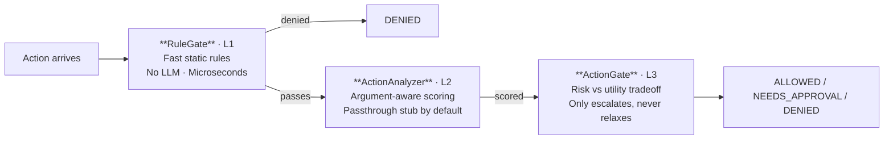

# agent-risk-engine

A layered protocol and reference implementation for codifying risk in autonomous agent actions.

See [PROTOCOL.md](PROTOCOL.md) for the language-agnostic protocol specification.

## Installation

### uv
```bash
uv add agent-risk-engine
```

### pip
```bash
pip install agent-risk-engine
```

## Quick Start

```python
from agent_risk_engine import RuleGate, RiskEvaluator, Action, GateResult

gate = RuleGate(threshold="cautious")
evaluator = RiskEvaluator(rule_gate=gate)

result = await evaluator.evaluate(Action(kind="tool_call", name="read_file", risk=1))
assert result.decision == GateResult.ALLOWED

result = await evaluator.evaluate(
    Action(kind="tool_call", name="execute_shell", parameters={"command": "rm -rf /"}, risk=5)
)
assert result.decision == GateResult.NEEDS_APPROVAL
```

## Architecture

Actions pass through a 3-layer pipeline:



**L1 (RuleGate)** and the **RiskUtilityGate** implementation of L3 are fully implemented. L2 ships as a passthrough stub — plug in your own `ActionAnalyzer`.

## Risk Levels

| Level | Label    | Meaning                          |
|-------|----------|----------------------------------|
| 1     | Info     | Read-only, no side effects       |
| 2     | Low      | Reads potentially sensitive data |
| 3     | Moderate | Reversible mutations             |
| 4     | High     | Hard-to-reverse mutations        |
| 5     | Critical | Destructive or irreversible      |

## RuleGate

Fast, deterministic, no LLM required. Supports per-kind threshold routing:

```python
gate = RuleGate(
    threshold="cautious",
    kind_thresholds={
        "tool_call": "standard",
        "file_write": 2,
        "code_execution": 1,
    },
    denied={"delete_database"},
    allowed={"read_logs"},
)
```

Evaluation order: `denied` → `allowed` → `approve` → threshold comparison.

### Threshold Aliases

| Alias        | Level | Description                     |
|--------------|-------|---------------------------------|
| `read-only`  | 1     | Only info-level actions         |
| `cautious`   | 2     | Info + low-risk actions         |
| `standard`   | 3     | Up to reversible mutations      |
| `full-trust` | 5     | Everything auto-allowed         |

## PatternAnalyzer

Scores actions by matching regex patterns against serialized parameters. Supports kind-scoped patterns:

```python
from agent_risk_engine import PatternAnalyzer, RiskPattern

analyzer = PatternAnalyzer(extra_patterns=[
    RiskPattern(r"\bDROP\b", 5, "SQL drop", kinds=frozenset({"database_query"})),
])
```

Pass it to `RiskEvaluator(rule_gate=gate, action_analyzer=analyzer)`.

## RiskUtilityGate

Weighs risk against caller-provided utility. Utility is an **input**, not computed internally — the library evaluates risk; your framework understands agent goals.

```python
evaluator = RiskEvaluator(
    rule_gate=RuleGate(threshold="standard"),
    action_gate=RiskUtilityGate(),
)

result = await evaluator.evaluate(
    Action(kind="tool_call", name="write_file", risk=3),
    utility=UtilityScore(level=4, reasoning="User explicitly requested"),
)
```

The gate **only escalates, never relaxes** — it cannot make a decision less restrictive than L1.

## Extending with Custom Analyzers

`ActionAnalyzer` is a `Protocol`. Implement `analyze(action: Action) -> RiskScore`:

```python
from agent_risk_engine import RiskEvaluator, RuleGate, RiskScore, Action

class LLMAnalyzer:
    """Use an LLM to evaluate the actual risk of action arguments."""

    async def analyze(self, action: Action) -> RiskScore:
        # Inspect action.parameters, reason about consequences
        assessed_level = await my_llm_judge(action.name, action.parameters)
        return RiskScore(level=assessed_level, reasoning="LLM analysis")

evaluator = RiskEvaluator(
    rule_gate=RuleGate(threshold="cautious"),
    action_analyzer=LLMAnalyzer(),
)
```

## CallTracker

Standalone loop and repetition detection. Not a pipeline layer — use it to build context before evaluating:

```python
from agent_risk_engine import CallTracker

tracker = CallTracker()
tracker.record(action.name)
context = tracker.check()
# Merge into action metadata before evaluating
action = Action(kind=action.kind, name=action.name, risk=action.risk, metadata=context)
```

`check()` returns `{"healthy": bool, "warnings": list[str]}`.

## Framework Integration

Write a thin adapter that maps your framework's action primitives to `Action`:

```python
async def before_action_hook(action_name, args, action_risk):
    action = Action(kind="tool_call", name=action_name, parameters=args, risk=action_risk)
    result = await evaluator.evaluate(action)

    if result.decision == GateResult.DENIED:
        raise PermissionError(result.reasoning)
    if result.decision == GateResult.NEEDS_APPROVAL:
        approved = await prompt_user(f"Allow '{action_name}'? Risk: {result.risk_score.level}/5")
        if not approved:
            raise PermissionError("User denied")
```

## License

MIT
